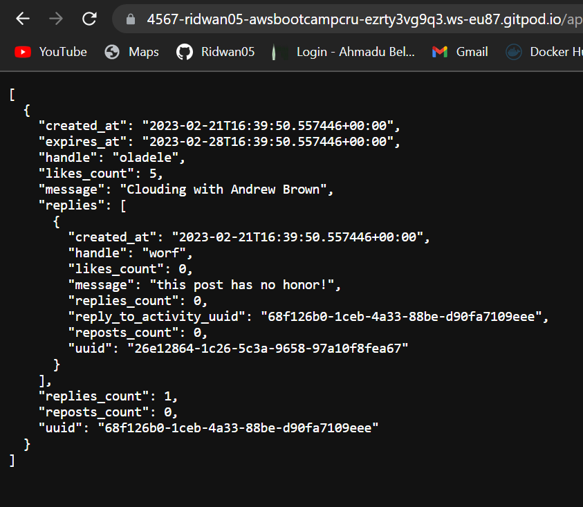
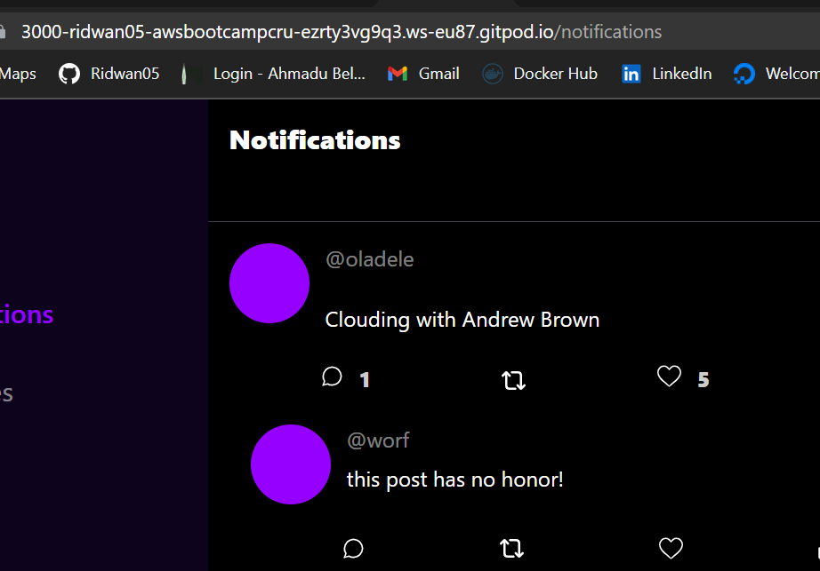
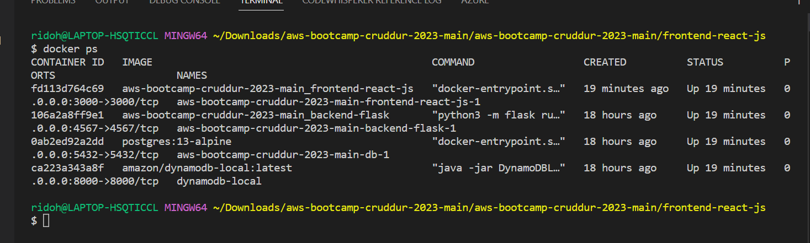
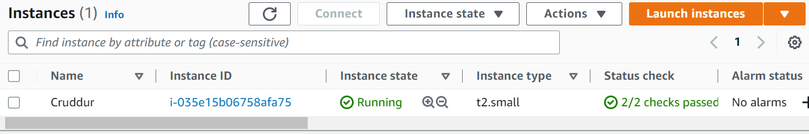
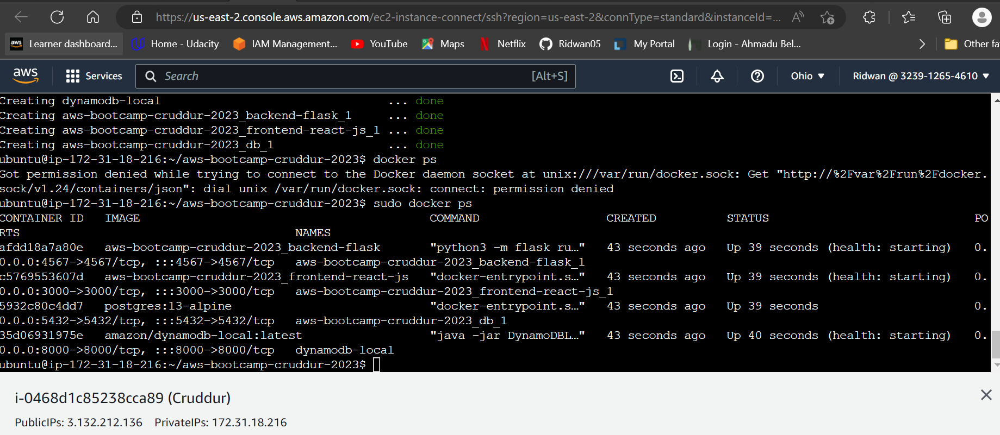

# Week 1 — App Containerization

## Required Homework
- Launched the repo within a Gitpod workspace
- Configured Gitpod.yml configuration, eg. I’m VSCode Extensions
- Cloned the frontend and backend repo
- Explored the codebases
- Got the apps running locally
- Wrote a Dockerfile for each app
- Got the apps running via individual container
- Created a docker-compose file
- Got both containers to run side by side using docker-compose file
- Implement backend notification  

  

- Implement frontend notification  

  
## Homework Challenge
- Pushed and tagged image to dockerhub  

  
  

- Implemented health check by appending the code block below to services in docker-compose file  
```
    healthcheck:
     test: curl --fail http://localhost || exit 1
     interval: 60s
     retries: 5
     start_period: 20s
     timeout: 10s
   
 ```
 - I already have docker installed on my system, I cloned this repo and ran the containers on my local environment  
 - 
   
   
 - Lauched an EC2  
 - 
   
   
 - Cloned this repo to the EC2 and ran containers  
   
   
